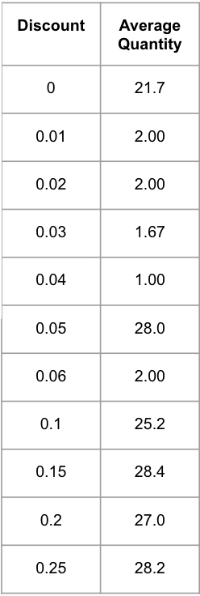
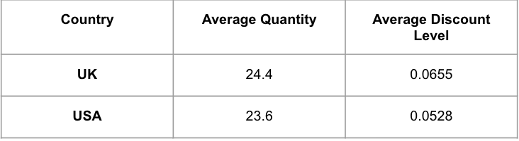
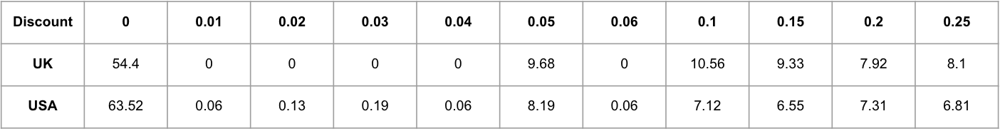
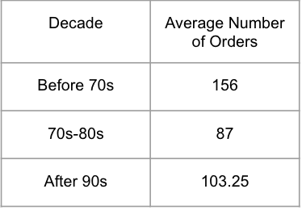
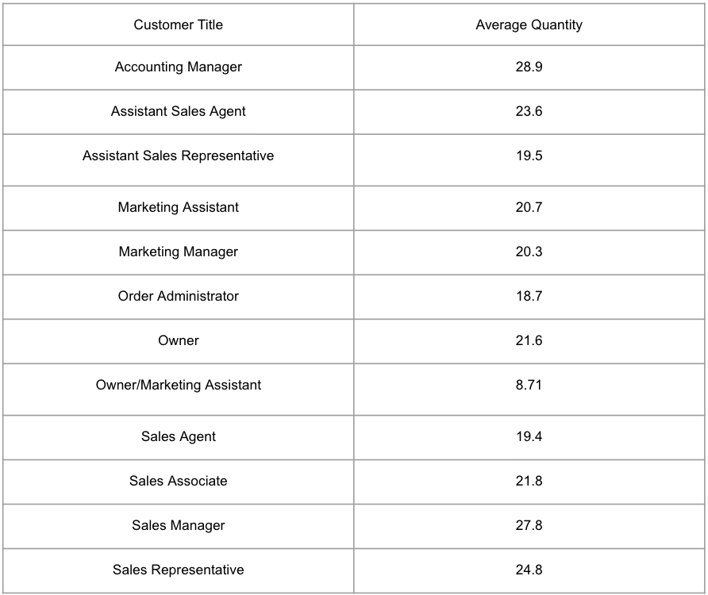
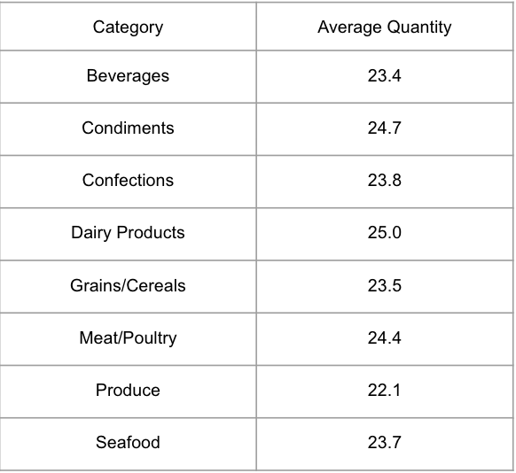
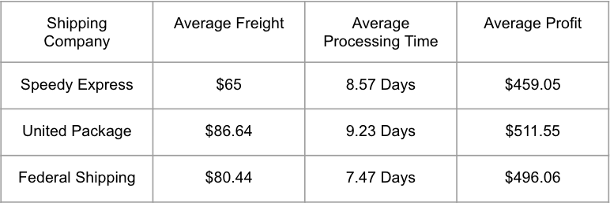

# Northwind Traders Business Exploration

## Northwind Database

The Northwind database is a sample database used by Microsoft to demonstrate the features of some of its products, including SQL Server and Microsoft Access. The database contains the sales data for Northwind Traders, a fictitious specialty foods export import company.

## Goal
In this statistical analysis, we perform hypothesis tests to answer the following questions for Northwind Traders:  
#### Question 1
**_Does discount amount have a statistically significant effect on the quantity of a product in an order? If so, at what level(s) of discount?_**
#### Question 2
**_Is there a statistically significant difference in the level(s) of discount offered by UK employees and USA employees?_**
**_Does the level(s) of discount offered by US employees have a statistically significant effect on the quantity ordered? If so, at what level(s) of discount?_**
**_Does the level(s) of discount offered by UK employees have a statistically significant effect on the quantity ordered? If so, at what level(s) of discount?_**
#### Question 3
**_Does the age of the employee have a statistically significant effect on number of orders processed?_**
**_Does having a managerial position in Northwind have a statistically significant effect on number of orders processed?_**
**_Does the age of the employee have a statistically significant effect on the quantity of a product in an order?_**
**_Does having manager in your title have a statistically significant effect on quantity ordered by a customer?_**
#### Question 4
**_For each category type of product, does the season in which the order was placed have a statistically significant effect on the quantity of a product in an order?_**
#### Question 5
**_Does shipping company used have a statistically significant effect on the freight cost of shipping?_**
#### Question 6
**_Does category of product have a statistically signficiant effect on processing time? If so, which ones?_**
**_Does having a discount on the order have a statistically significant effect on processing time?_**
**_Does size of order have a statistically signficant effect on processing time?_**
**_Does shipping company have a statistically significant effect on processing time?_**

## Methodology

For answering our questions, we conducted one-tailed ANOVA tests followed by Tukey HSD Post-HOC tests afterwards to find the where the difference in mean is observed if there is one.

### Question 1
#### Does discount amount have a statistically significant effect on the quantity of a product in an order? If so, at what level(s) of discount?

H0: there is no significant difference in quantity ordered due to discount (the means are equal)  
H_&alpha;_: there is a significant difference in order quantity due to discount (the means are not equal)

#### At what level(s) of discount is there a statistically significant difference in quantity ordered?

H0 (for each level): there is no significant difference in quantity ordered due to that specific discount level  (the means are equal)  
H_&alpha;_ (for each level): there is a significant difference in order quantity due to that specific discount level (the means are not equal)

### Question 2
#### Is there a statistically significant difference in the level(s) of discount offered by UK employees and USA employees?

H0: there is no significant difference in level(s) of discount offered by the two countries  (the means are equal)  
H_&alpha;_: there is a significant difference in level(s) of discount offered by the two countries (the means are not equal)

#### Does the level(s) of discount offered by US employees have a statistically significant effect on the quantity ordered? If so, at what level(s) of discount?

H0 (for each level): there is no significant difference in quantity ordered due to that specific discount level  (the means are equal)  
H_&alpha;_ (for each level): there is a significant difference in order quantity due to that specific discount level (the means are not equal)

#### Does the level(s) of discount offered by UK employees have a statistically significant effect on the quantity ordered? If so, at what level(s) of discount?

H0 (for each level): there is no significant difference in quantity ordered due to that specific discount level  (the means are equal)  
H_&alpha;_ (for each level): there is a significant difference in order quantity due to that specific discount level (the means are not equal)

### Question 3
#### Does the age of the employee have a statistically significant effect on number of orders processed?

H0: there is no significant difference in total sum of orders processed due employee age  (the means are equal)  
H_&alpha;_: there is a significant difference in total sum of orders processed due to employee age (the means are not equal)

#### Does having a managerial position in Northwind have a statistically significant effect on number of orders processed?

H0: there is no significant difference in total sum of orders processed due to the employee receiving order having a managerial position  (the means are equal)  
H_&alpha;_: there is a significant difference in total sum of orders processed due to the employee receiving order having a managerial position (the means are not equal)

#### Does the age of the employee have a statistically significant effect on the quantity of a product in an order?

H0: there is no significant difference in quantity ordered due employee age  (the means are equal)  
H_&alpha;_: there is a significant difference in order quantity ordered due to employee age (the means are not equal)

#### Does having manager in your title have a statistically significant effect on quantity ordered by a customer?

H0: there is no significant difference in quantity ordered due to the employee making order having a managerial position  (the means are equal)  
H_&alpha;_: there is a significant difference in order quantity ordered due to the employee making order having a managerial position (the means are not equal)

### Question 4
#### For each category type of product, does the season in which the order was placed have a statistically significant effect on the quantity of a product in an order?

H0: there is no significant difference in quantity ordered due to season in which order was placed  (the means are equal)  
H_&alpha;_: there is a significant difference in order quantity ordered due to season in which order was placed (the means are not equal)

### Question 5
#### Does shipping company used have a statistically significant effect on the freight cost of shipping?

H0: there is no significant difference in freight cost due to shipper  (the means are equal)  
H_&alpha;_: there is a significant difference in freight cost due to shipper (the means are not equal)

### Question 6
#### Does category of product have a statistically signficiant effect on processing time? If so, which ones?

H0: there is no significant difference in processing time due to category of product  (the means are equal)  
H_&alpha;_: there is a significant difference in order quantity due to category of product (the means are not equal)

#### Does having a discount on the order have a statistically significant effect on processing time?

H0: there is no significant difference in processing due to discount being applied  (the means are equal)  
H_&alpha;_: there is a significant difference in processing due to discount being applied (the means are not equal)

#### Does size of order have a statistically signficant effect on processing time?

H0: there is no significant difference in processing time due to quantity ordered  (the means are equal)  
H_&alpha;_: there is a significant difference in processing time due to quantity ordered (the means are not equal)

#### Does shipping company have a statistically significant effect on processing time?

H0: there is no significant difference in processing time due to shipper  (the means are equal)  
H_&alpha;_: there is a significant difference in processing time due to shipper (the means are not equal)

## Breakdown of Strategy

Explore factors we may control that could potentially affect revenue and cost.  
Discounts, Employee efficiency, Types of Products and quantity purchased, and Shipping efficiency.

## Overview of Data

 

## Results
#### Question 1
Does discount amount have a statistically significant effect on the quantity of a product in an order? If so, at what level(s) of discount? **Reject Null Hypothesis and levels 0.01-0.06 and 0.15 are the best.**  
#### Question 2
Is there a statistically significant difference in the level(s) of discount offered by UK employees and USA employees?  **Reject Null Hypothesis**  
Does the level(s) of discount offered by US employees have a statistically significant effect on the quantity ordered? If so, at what level(s) of discount?  **Reject Null Hypothesis and levels 0.01-0.06 and 0.15 are the best.**  
Does the level(s) of discount offered by UK employees have a statistically significant effect on the quantity ordered? If so, at what level(s) of discount? **Reject Null Hypothesis and level 0.25 is the best.**    
#### Question 3
Does the age of the employee have a statistically significant effect on number of orders processed? **Cannot reject Null Hypothesis.**  
Does having a managerial position in Northwind have a statistically significant effect on number of orders recieved? **Cannot reject Null Hypothesis.**  
Does the age of the employee have a statistically significant effect on the quantity of a product in an order? **Cannot reject Null Hypothesis.**  
Does having manager in your title have a statistically significant effect on quantity ordered by the customer? **Reject Null Hypothesis and 4.83 greater difference in mean when customers' employees making the order have a managerial position.**  
#### Question 4
For each category type of product, does the season in which the order was placed have a statistically significant effect on the quantity of a product in an order? **Reject Null Hypothesis for Dairy Products in Winter: +4.99 units, Seafood in Spring: -4.95 units, Condiments in Winter: +6.97 units, and Condiments in Spring: -5.83 units.**  
#### Question 5
Does shipping company used have a statistically significant effect on the freight cost of shipping? **Cannot reject Null Hypothesis.**   
#### Question 6
Does category of product have a statistically signficiant effect on processing time? If so, which ones? **Cannot reject Null Hypothesis.**  
Does having a discount on the order have a statistically significant effect on processing time? **Cannot reject Null Hypothesis.**   
Does size of order have a statistically signficant effect on processing time? **Cannot reject Null Hypothesis.**  
Does shipping company have a statistically significant effect on processing time? **Reject Null Hypothesis for difference between Shipping Company 2 (United Package) and 3 (Federal Shipping) with a mean difference of -1.76 days in favor of United Package. United Package has a greater average freight cost however.**

## Suggestions

- As a company, I would suggest not offer discount levels above 15%.  
- US employees should not offer discount levels above 15% and UK employees should offer only 25%. However, I would suggest UK employees testing if lower discount levels from 1-6% are better for them since they do not offer many low level discounts.  
- Try to speak to manager's when pushign for orders from your customers as they tend to have more buying power.  
- Try to reflect production on when the products we found are affected by seasons are more or less in demand that time of the year. It will open up time for other tasks, otehr production elsewhere.
- Using Federal Shipping will lower process time (days between order date and shipping date).

## Further Steps

- Further investigate if lowering discount level below suggested 15% is better  
- Find out optimal levels of discount for each product for their seasonal demand (if that exists)  
- Explore where to lower costs whether in employee demmographic or shipping

